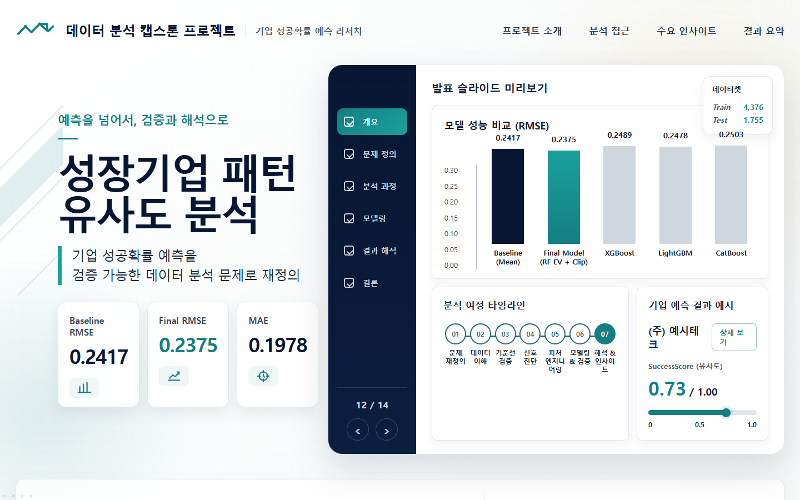

# 성장기업 패턴 유사도 분석 MVP

DACON 기업 성공확률 예측 데이터를 기반으로 만든 정적 웹 MVP입니다.  
단순히 성공확률을 맞히는 화면이 아니라, 학습 데이터에서 관찰된 성장기업 패턴과 얼마나 유사한지 탐색하고 해석 책임성을 함께 보여주는 프로젝트 페이지입니다.

## 배포 첫 화면

배포 URL: https://dacon-company-success-mvp.vercel.app



## 무엇을 만들었나

- 배포 첫 화면으로 프로젝트 소개용 메인 홈 구현
- `successScore`를 실제 미래 성공확률이 아니라 성장기업 패턴 유사도 점수로 표현
- 예측 결과를 등급, 신뢰도, risk flags, 산업군 근거와 함께 확인하는 탐색형 대시보드 구현
- 산업군별 RMSE와 공개자료 기반 참고 지표를 함께 배치해 점수 해석의 한계를 표시
- 공개자료 기반 스타트업 예시를 DACON 컬럼 구조에 맞춰 매칭한 참고 화면 구현
- 최종 분석 발표 HTML(`capstone_final_presentation.html`)로 이동할 수 있는 링크 포함

## 주요 화면

1. **메인 홈**
   - 프로젝트 목적, 핵심 성능 지표, 분석 발표와 MVP 데모 진입 버튼 제공
   - 배포 접속 시 가장 먼저 보이는 화면

2. **기업 탐색**
   - test 1,755개 기업의 score100, 등급, 신뢰도, risk flags 확인
   - 기업 선택 시 상세 점수, 추천 사유, 해석 주의 메시지 표시

3. **산업군 근거**
   - 산업군별 검증 RMSE와 표본 수 확인
   - 외부 공개자료로 보강 가능한 지표를 함께 제시

4. **스타트업 예시**
   - 실제 공개자료를 DACON 컬럼에 맞춰 구성한 예시 기업 표시
   - 모델 적용 가능성과 데이터 부족 위험을 함께 설명

## 실행 방법

```bash
python -m http.server 8766
```

브라우저에서 아래 주소를 엽니다.

```text
http://127.0.0.1:8766/index.html
```

## 배포 방법

정적 파일만 사용하므로 Vercel, GitHub Pages, Netlify에 그대로 배포할 수 있습니다.

- 배포 루트: 이 폴더(`portfolio/mvp`)
- 진입 파일: `index.html`
- MVP 대시보드 파일: `dashboard.html`
- 발표 파일: `capstone_final_presentation.html`
- 데이터 파일: `data/*.js`
- 이미지 파일: `assets/readme-first-screen.png`

Vercel에서 배포할 경우 Framework Preset은 `Other` 또는 `Static`으로 두고, Build Command와 Output Directory는 비워 둡니다.

현재 확인된 Vercel 배포 주소는 아래와 같습니다.

```text
https://dacon-company-success-mvp.vercel.app
```

## 해석 주의

`successScore`는 실제 미래 성공확률이 아닙니다.  
본 프로젝트에서는 학습 데이터 내 성장기업 패턴과의 유사도 점수로 해석하며, 반드시 데이터 신뢰도, 외삽 위험, 산업군 근거와 함께 확인해야 합니다.
